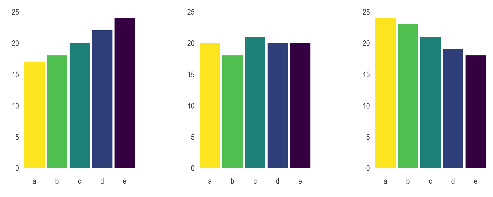

```{r setup, include=FALSE}
knitr::opts_chunk$set(echo = T)
library(ggplot2)
library(dplyr)
options(editor = "notepad")
```

```{r producaoBruta, eval=T, echo=FALSE}
producaoBruta <-
  read.table(
    'data/Producao_Bruta.csv',    
    header = TRUE,sep = "," ,dec = ",",
    quote = "\"",fill = TRUE,
    fileEncoding = "latin1")

producaoBruta$Ano.base <- as.factor(producaoBruta$Ano.base)

colnames(producaoBruta) <-
  c("Ano.base",
    "UF",
    "Classe.Substância",
    "Substância.Mineral",
    "Quantidade.Produção.Minério.ROM",
    "Quantidade.Contido",
    "Unidade.de.Medida.Contido",
    "Indicação.Contido",
    "Quantidade.Venda",
    "Valor.Venda",
    "Quantidade.Transformação.Consumo.Utilização",
    "Valor.Transformação.Consumo.Utilização",
    "Quantidade.Transferência.para.Transformação.Utilização.Consumo",
    "Valor.Transferência.para.Transformação.Utilização.Consumo")

```

## Visualizando a informação
- **Introdução ao ggplot2**
- **Trabalhando com camadas**
- **Objetos geométricos**	
- **Escalas no ggplot2**
- **Tipos de variáveis e tipo de gráfico**
- **Customização com temas**

- para aula de hoje vamos carregar os pacotes `library(dplyr)`
    
    
    
## Visualizando a informação | Introdução ao ggplot2
    
- `ggplot` e `ggplot2` são pacotes populares para a criação de gráficos no R
- Tem a conveniência de tratar cada elemento do gráfico como uma camada 
- Um antigo expediente editorial de se compor figuras sobrepondo "lâminas" transparentes

```{r echo=TRUE, eval=FALSE}
install.packages("ggplot2")
library("ggplot2")
```


## Visualizando a informação | Trabalhando com camadas

- Iniciamos a construção de um gráfico com a função `ggplot()`
- Dentro da função `ggplot()` definimos a base de dados alvo do nosso gráfico e dessa forma adicionamos nossa primeira camada

- Comecemos adicionando a camada correspondente ao sistema de coordenadas

```{r eval=FALSE}
ggplot(data = producaoBruta,
       mapping = aes(x = Ano.base, y = Quantidade.Venda))
```

## | 1ª camada: o sistema de coordenadas

```{r fig.align="center"}
ggplot(data = producaoBruta,
       mapping = aes(x = Ano.base, y = Quantidade.Venda))
```

## Visualizando a informação | 2ª camada: Objetos geométricos

- O pacote `ggplot::` possui uma função para cada tipo de visualização, sejam barras, linhas, pontos, etc
- Tais formas gráficas são objetos geométricos que criamos com as funções `geom_col()`, `geom_line()` e `geom_point()`, dentre outras.
- Começaremos com um gráfico de pontos, representaremos o valor das vendas por ano:

```{r echo=TRUE, eval=FALSE}
ggplot(
  data = summarise(
    group_by(producaoBruta, Ano.base),
    "Quantidade.Venda" = sum(Quantidade.Venda)
  ),
  mapping = aes(x = Ano.base, y = Quantidade.Venda)
) +
  geom_point()
```


## | geom_point()

```{r echo=TRUE}
g <- ggplot(summarise(group_by(producaoBruta, Ano.base),
            "Quantidade.Venda" = sum(Quantidade.Venda)))
  
g +  geom_point(mapping = aes(x = Ano.base, y = Quantidade.Venda))
```

## | geom_col()

```{r echo=TRUE}
g + geom_col(mapping = aes(x = Ano.base, y = Quantidade.Venda))
```


## Visualizando a informação | Objetos geométricos

- Uma vez que cada conjunto de objetos geométricos é tratado como uma camada, podemos sobrepô-los. Ex: uma vizualização de pontos sobre uma vizualização de barras

```{r echo=T, eval=FALSE}
g <- ggplot(
  summarise(
    group_by(producaoBruta, Ano.base),
"Quantidade.Venda" = sum(Quantidade.Venda),
"Quantidade.Transferência" = sum(Quantidade.Transferência.para.Transformação.Utilização.Consumo),
"Quantidade.Transformação" = sum(Quantidade.Transformação.Consumo.Utilização)))

g +
  geom_col(mapping = aes(x = Ano.base, y = Quantidade.Venda)) +
  geom_point(mapping = aes(x = Ano.base, y = Quantidade.Transferência)) +
  geom_point(mapping = aes(x = Ano.base, y = Quantidade.Transformação))
```

## | geom_point() + geom_col()
```{r echo=F, eval=T}
g <- ggplot(
  summarise(
    group_by(producaoBruta, Ano.base),
"Quantidade.Venda" = sum(Quantidade.Venda),
"Quantidade.Transferência" = sum(Quantidade.Transferência.para.Transformação.Utilização.Consumo),
"Quantidade.Transformação" = sum(Quantidade.Transformação.Consumo.Utilização)))

g +  geom_col(mapping = aes(x = Ano.base, y = Quantidade.Venda)) +
     geom_point(mapping = aes(x = Ano.base, y = Quantidade.Transferência)) +
     geom_point(mapping = aes(x = Ano.base, y = Quantidade.Transformação))
```


## Visualizando a informação | Objetos geométricos

- Ao Adicionarmos muitas camadas gráficas convém distinguir os elementos:

```{r echo=T, eval=FALSE}
ggplot(
  mapping = aes(x = Ano.base, y = Quantidade.Venda),
  summarise(group_by(producaoBruta, Ano.base),
"Quantidade.Venda" = 
  sum(Quantidade.Venda),
"Quantidade.Transferência" = 
  sum(Quantidade.Transferência.para.Transformação.Utilização.Consumo),
"Quantidade.Transformação" = 
  sum(Quantidade.Transformação.Consumo.Utilização))) +
  geom_col(fill = "LightGray") +
  geom_point(
    mapping = aes(x = Ano.base, y = Quantidade.Transferência),
    fill = "navy",shape = 21,size = 4) +
  geom_point(
    mapping = aes(x = Ano.base, y = Quantidade.Transformação),
    fill = "Orange",shape = 21,size = 4)
```

## | geom_col() + geom_point() + geom_point()
```{r echo=F, eval=T}
ggplot(
  summarise(
    group_by(producaoBruta, Ano.base),
    "Quantidade.Venda" = sum(Quantidade.Venda),
    "Quantidade.Transferência" = sum(
      Quantidade.Transferência.para.Transformação.Utilização.Consumo
    ),
    "Quantidade.Transformação" = sum(Quantidade.Transformação.Consumo.Utilização)
  )
) +
  geom_col(mapping = aes(x = Ano.base, y = Quantidade.Venda), fill = "LightGray") +
  geom_point(
    mapping = aes(x = Ano.base, y = Quantidade.Transferência),
    fill = "navy",
    shape = 21,
    size = 4
  ) +
  geom_point(
    mapping = aes(x = Ano.base, y = Quantidade.Transformação),
    fill = "Orange",
    shape = 21,
    size = 4
  )
```


## Visualizando a informação | Objetos geométricos e escalas no ggplot2

- Realçando por cor cada variável categórica

```{r echo=T, eval=FALSE}
ggplot(
  summarise(group_by(producaoBruta, Ano.base, Classe.Substância),
"ROM" = 
  sum(Quantidade.Produção.Minério.ROM))) +
  geom_point(mapping = aes(
    x = Ano.base,
    y = ROM,
    color = Classe.Substância,
    size = 6,
    alpha = 5
  ))
```

## | geom_point(color)
```{r eval=T, echo=F, message=FALSE, warning=FALSE}
ggplot(
  summarise(group_by(producaoBruta, Ano.base, Classe.Substância),
"ROM" = 
  sum(Quantidade.Produção.Minério.ROM))) +
  geom_point(mapping = aes(x = Ano.base, y = ROM, color = Classe.Substância, size = 6, alpha = 5))
```

## | geom_point(color, size)
```{r eval=T, echo=F, message=FALSE, warning=FALSE}
ggplot(
  summarise(group_by(producaoBruta, Ano.base, Classe.Substância),
"ROM" = 
  sum(Quantidade.Produção.Minério.ROM))) +
  geom_point(mapping = aes(
    x = Ano.base,
    y = ROM,
    color = Classe.Substância,
    size = Classe.Substância, alpha = 6
    ))
```


## | geom_point(color, size) 
```{r eval=F, echo=T, message=FALSE, warning=FALSE}
ggplot(summarise(
  group_by(
    producaoBruta[producaoBruta$Ano.base %in% 
                    c('2016', '2017', '2018', '2019', 
                      '2020', '2021', '2022'),], 
    Ano.base, Classe.Substância),
  "Valor.Venda" = sum(Valor.Venda),
  "Quantidade.Venda" = sum(Quantidade.Venda)
)) +
  geom_point(
    mapping = aes(
      x = Quantidade.Venda,
      y = Valor.Venda,
      size = Classe.Substância,
      color = Ano.base,
      alpha = 6
    )
  )
```

## | geom_point(color, size) 
```{r eval=T, echo=F, message=FALSE, warning=FALSE}
ggplot(
  summarise(group_by(producaoBruta[producaoBruta$Ano.base %in% c('2016','2017','2018','2019','2020','2021','2022'),], Ano.base, Classe.Substância),
"Valor.Venda" = sum(Valor.Venda), 
"Quantidade.Venda" = sum(Quantidade.Venda))) +
  geom_point(mapping = aes(
    x = Quantidade.Venda,
    y = Valor.Venda,
    size = Classe.Substância,color = Ano.base, alpha = 6))
```


## | Tipos de variáveis e tipo de gráfico

|  Tipo de Gráfico          | Função                 | X        | Y        |
|---------------------------|------------------------|----------|----------|
|  Gráfico de linhas        | geom_line()            | Contínuo | Contínuo |
|  Dispersão (Pontos)       | geom_point()           | Contínuo | Contínuo |
|  Gráfico de barras        | geom_col(); geom_bar() | Discreto | Contínuo |
|  Gráfico de Área          | geom_area()            | Contínuo | Contínuo |
|  Degraus (Step Graph)     | geom_step()            | Contínuo | Contínuo |


## Visualizando a informação | Tipos de variáveis e tipo de gráfico
    
- Não é nada aconselhável usarmos gráficos de setores, popularmente "de pizza".
    
<div align = "center">
    
{width="600"}
  
</div>

- É que o ser humano não é bom em comparar ângulos: abaixo foi usado o mesmo conjunto de dados dos gráficos acima:
    
  
<div align = "center">
    
{width="450"}
    </div>
    
## | Tipos de variáveis e tipo de gráfico
    
- Restrija-se ao gráfico de setores para comparar Áreas

- Nunca use gráficos de pizza 3D, isso só aumenta os problemas.
    
<div align = "center">
    

  
</div>
    
    
## Visualizando a informação |Customização com temas

- A camada de temas é adicionada com as funções `theme_bw()`, `theme_classic()`, `theme_light()`, etc.

```{r eval=F}
install.packages("ggthemes")
library(ggthemes)

data <- 
summarise(
  group_by(
    producaoBruta[producaoBruta$Substância.Mineral == "Calcário", ], UF),
  "ROM(t)" = sum(Quantidade.Produção.Minério.ROM))

g <- ggplot(data)

g +
geom_col(mapping = aes(x = UF, y = `ROM(t)`)) + 
  ggthemes::theme_economist()
  


```


    
    